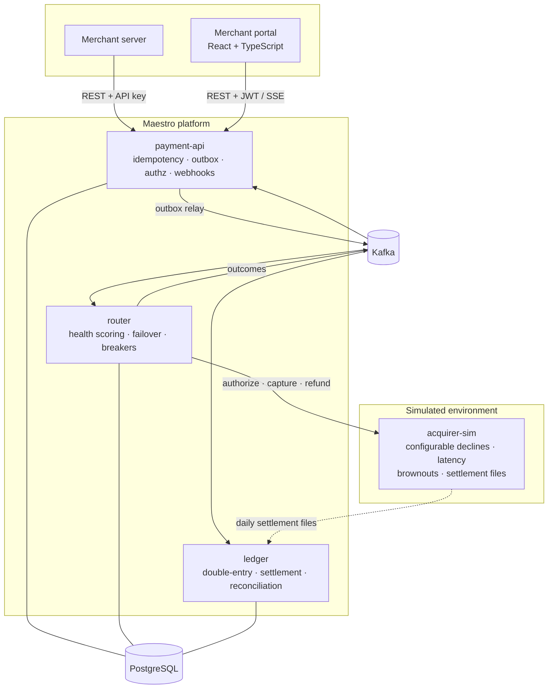

# Maestro — Payment Orchestration Platform

**Maestro accepts payments from many merchants and routes each transaction to the best of several acquiring banks — automatically shifting traffic away from a degrading acquirer so merchants' authorization success rates stay flat — while a double-entry ledger and daily reconciliation guarantee every cent is accounted for.**

> **Status: Phase 0 — design complete, implementation begins in Phase 1.**
> Every document in [`docs/`](docs/) is written. No code exists yet, by design: the architecture, the domain model, the API surface, the authorization model and thirteen decision records were settled first. See the [roadmap](docs/ROADMAP.md).

Everything runs on a laptop. `docker compose up` brings up the whole platform — services, Kafka, Postgres, observability, the merchant portal, and a fleet of simulated acquiring banks you can break on purpose.

---

## The problem this solves

A merchant's checkout is only as reliable as the acquiring bank behind it. Acquirers degrade: latency creeps up, technical declines spike, an entire region browns out for twenty minutes. A payments platform that hard-codes one acquirer passes that failure straight through to the merchant as lost revenue.

Real orchestration platforms — Stripe, Adyen, Primer — solve this by holding relationships with several acquirers and deciding, per transaction, which one to use. That decision is the interesting part, and it is full of traps:

- If you always send traffic to the current best acquirer, you stop collecting data about the others and can never tell when they recover. **Exploration is mandatory.**
- If you retry a *business* decline ("insufficient funds", "stolen card") on a different acquirer, you are violating card-scheme rules and building a fraud vector. Only *technical* failures may be retried elsewhere. **The distinction between the two is the whole game.**
- If retries are unbounded, an acquirer brownout turns into a retry storm that takes down the acquirers that were still healthy.
- And underneath all of it, the money must still balance — through authorizations, captures, partial refunds, fees, settlement timing gaps and the occasional one-cent discrepancy in a bank's settlement file.

Maestro is built to demonstrate solutions to exactly these problems, with evidence rather than assertions.

---

## Architecture



Four JVM services and a web portal, each with one job. Full detail — component responsibilities, the payment state machine, event flows and sequence diagrams — is in [`docs/architecture/overview.md`](docs/architecture/overview.md).

---

## What this project demonstrates

| | |
|---|---|
| **Distributed systems** | Transactional outbox, at-least-once delivery with exactly-once *money effects*, per-payment ordering, idempotency at every boundary |
| **The flagship problem** | Adaptive multi-acquirer routing: EWMA health scoring per corridor, cost weighting, mandatory exploration, cascading failover, circuit breakers, retry budgets |
| **Financial correctness** | Double-entry ledger with database-enforced balance invariants, append-only postings, authorization holds modelled separately from movements, a concurrent double-capture race test |
| **Reconciliation** | Settlement-file ingestion, line-level matching, discrepancy classification, drift metrics — the unglamorous work that real payments teams live on |
| **Security** | Four-role RBAC on permissions (not roles), per-merchant scoping with Postgres row-level security as defence in depth, `404`-not-`403` to avoid leaking existence, card data never entering the system |
| **Operations** | End-to-end tracing of a single payment, dashboards as code, chaos experiments, runbooks written before they are needed |
| **Full-stack range** | A polished merchant portal with a live payment feed and RBAC-gated money actions |
| **Engineering judgement** | Thirteen decision records that say what was rejected and why, and a written backlog of everything deliberately not built |

---

## Roadmap

- [x] **Phase 0** — Design foundation: architecture, domain, API, authorization model, 13 ADRs
- [ ] **Phase 1** — Walking skeleton: create → confirm → authorize end-to-end, running locally
- [ ] **Phase 2** — The books: double-entry ledger, holds, capture/void/refund, race tests
- [ ] **Phase 3** — The flagship: adaptive routing, failover, circuit breakers, the brownout demo
- [ ] **Phase 4** — The evidence: tracing, dashboards, load reports, chaos experiments
- [ ] **Phase 5** — Settlement & reconciliation: files, matching, discrepancies, payouts, webhooks
- [ ] **Phase 6** — RBAC & merchant portal
- [ ] **Phase 7** — Kubernetes on a local cluster, CI polish, demo recording
- [ ] **Phase 8** — *(optional)* Ephemeral AWS deployment via Terraform

Each phase leaves the repository in a finished, demoable state. Details and definitions of done: [`docs/ROADMAP.md`](docs/ROADMAP.md).

---

## Documentation

| Document | What it covers |
|---|---|
| [Vision](docs/VISION.md) | Why this exists, who it is for, what "done" means |
| [Roadmap](docs/ROADMAP.md) | The eight phases, deliverables, demo criteria, definitions of done |
| [Architecture overview](docs/architecture/overview.md) | C4 diagrams, services, state machine, event flows, data ownership |
| [Domain model](docs/domain.md) | Payments vocabulary, entities, money-handling rules, invariants |
| [API design](docs/architecture/api-design.md) | REST surface, idempotency, errors, pagination, webhooks |
| [Authorization model](docs/security/authz-model.md) | Roles, permissions, tenant isolation, PCI scope boundary |
| [Decision records](docs/adr/README.md) | Thirteen ADRs — the trade-offs, including the rejected options |
| [Operations](docs/operations/README.md) | Runbooks and the incident-response posture |
| [Backlog](docs/backlog.md) | Consciously deferred work, with the reasoning |

---

## Quickstart

*Available from Phase 1.* The intent, kept honest by a CI job that executes it:

```bash
git clone <this repo> && cd maestro
docker compose -f deploy/compose/docker-compose.yml up -d
./scripts/demo-first-payment.sh
```

---

## Licence

MIT — see [LICENSE](LICENSE).
