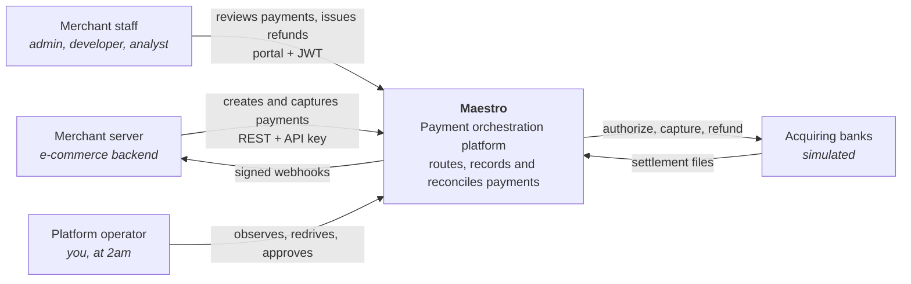
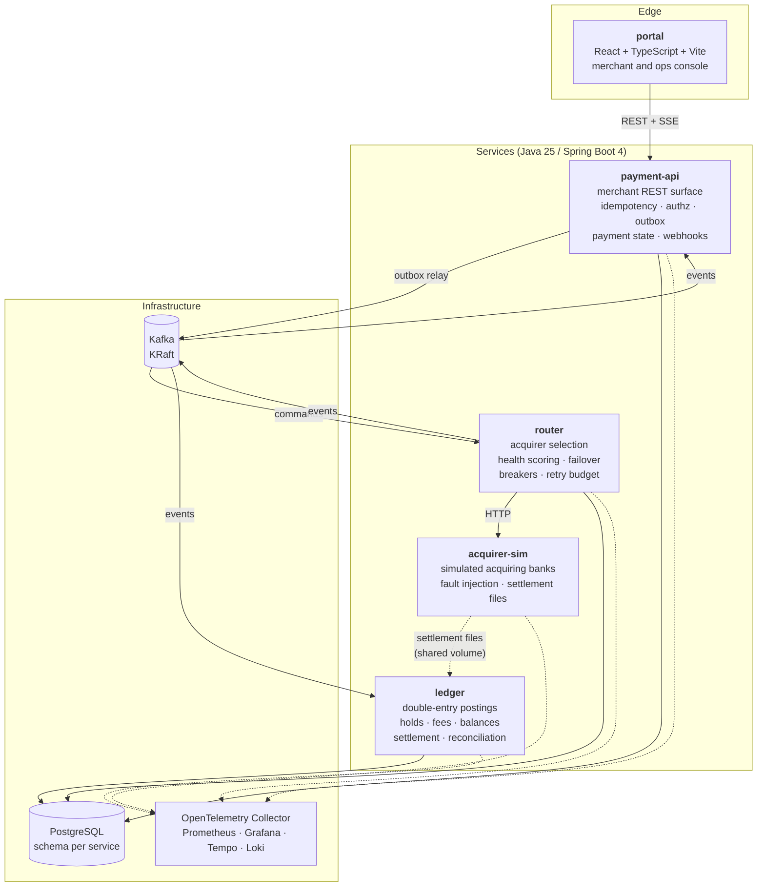
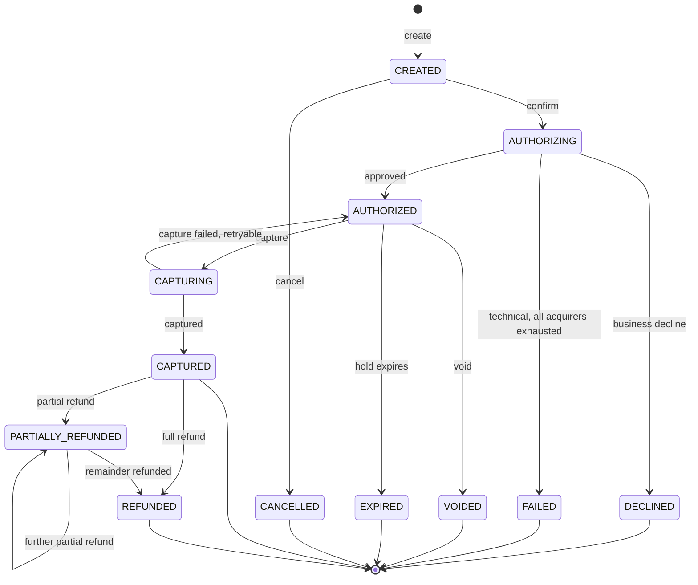
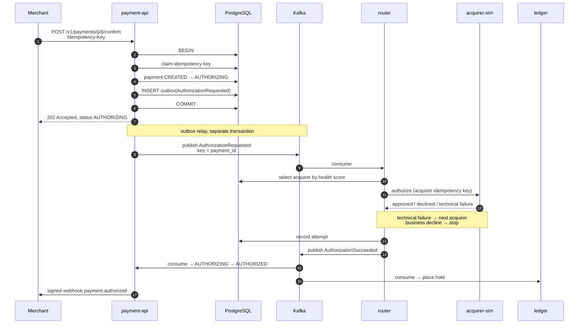
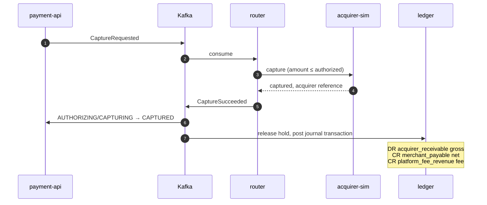
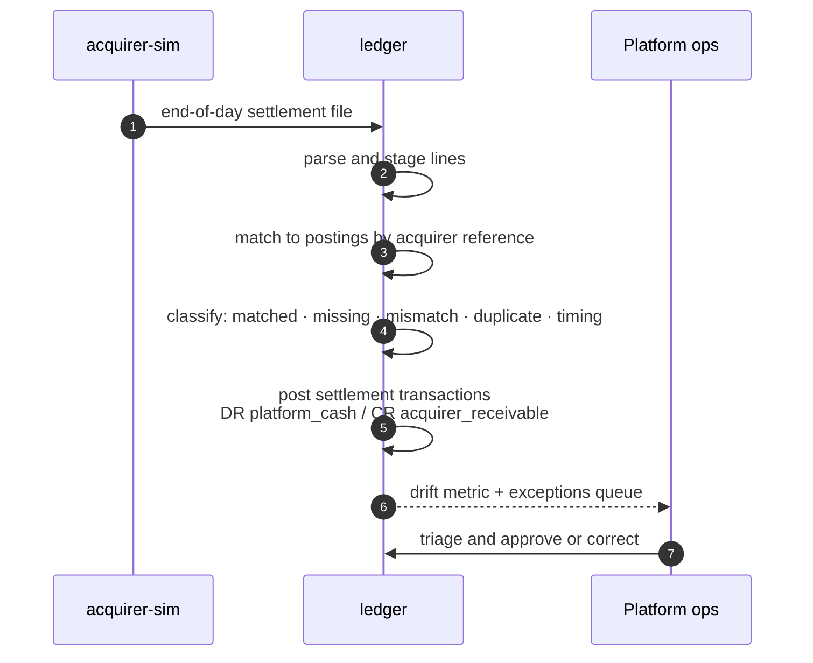

# Architecture Overview

Maestro is four JVM services, a web portal, and a fleet of simulated acquiring banks, communicating over Kafka and backed by PostgreSQL. This document covers the system context, the containers and their responsibilities, the payment state machine, the event flows, data ownership and the repository structure.

Related reading: [domain model](../domain.md) · [API design](api-design.md) · [authorization model](../security/authz-model.md) · [decision records](../adr/README.md)

---

## 1. System context



**Scope boundary.** Maestro never sees a card number. Merchants send opaque tokens; the tokenisation vault is outside the trust boundary and simulated. See [ADR-0011](../adr/0011-simulated-acquirers.md).

---

## 2. Containers



### payment-api

The merchant-facing front door and the owner of payment *intent*.

- Accepts and validates merchant instructions: create, confirm, capture, void, refund
- Enforces authentication (API keys for servers, JWTs for portal users) and per-merchant scoping
- Guarantees idempotency: a repeated request with the same key returns the original response and produces no second effect
- Owns the payment state machine and the payment/refund records
- Writes commands to the transactional outbox in the same database transaction as the state change ([ADR-0004](../adr/0004-transactional-outbox.md))
- Consumes outcome events and advances payment state
- Delivers signed webhooks to merchants and streams live events to the portal over SSE

It does **not** talk to acquirers, and it does **not** post to the ledger. Both would couple the merchant request path to downstream availability.

### router

The heart of the system, and the reason the project exists.

- Consumes authorization, capture, refund and void commands, keyed by payment so operations on one payment are strictly ordered
- Maintains a health model per **acquirer-corridor** — an acquirer combined with a card network and currency, because an acquirer can be healthy for Visa/AUD and failing for Mastercard/USD
- Selects an acquirer by cost-weighted score with a mandatory exploration floor
- Cascades to the next-best acquirer on *technical* failure; never re-attempts a *business* decline elsewhere ([ADR-0012](../adr/0012-never-retry-business-declines.md))
- Applies circuit breakers, jittered backoff and a global retry budget
- Records every attempt — acquirer, latency, response code, outcome — as the audit trail behind routing decisions
- Publishes outcome events

### ledger

The authoritative record of money, and the only service permitted to write postings.

- Consumes payment outcome events and translates them into double-entry journal transactions
- Models authorization **holds** separately from movements: an authorization reserves funds, it does not move them
- Calculates fees at capture
- Enforces balance invariants in the database, not in application code
- Ingests acquirer settlement files, matches them line by line against postings, classifies discrepancies and reports drift
- Produces merchant payout statements

Postings are append-only. A correction is a reversing entry, never an update. ([ADR-0008](../adr/0008-double-entry-projection.md))

### acquirer-sim

Simulated acquiring banks — the instrument that makes every resilience claim demonstrable.

- Multiple named acquirers, each with per-corridor cost, capacity and behaviour
- Realistic responses: approvals, business declines with scheme-style response codes, technical failures, timeouts, `429` throttling
- A fault-injection API: set decline rate, latency distribution, timeout rate, throughput cap, or force brownout or blackout — at runtime, without a restart
- Deterministic seeded modes so demos and tests reproduce exactly
- Honours acquirer idempotency keys, so a retried attempt is not double-authorized — which is what makes the retry logic testable
- Emits end-of-day settlement files, including an injectable-discrepancy mode

### portal

React, TypeScript and Vite. A live payment feed over SSE, payment detail showing attempt history and ledger postings side by side, the routing and acquirer-health visualisation that makes the brownout demo legible, reconciliation exceptions, balances and payouts — with RBAC-gated write actions.

---

## 3. The payment state machine



Three properties make this machine trustworthy:

**Transitions are guarded and idempotent.** Every transition is a conditional update predicated on the current state (`UPDATE ... WHERE status = ?`). A duplicate event that would repeat a transition affects zero rows and is acknowledged without effect. This is what allows at-least-once delivery to produce exactly-once money effects ([ADR-0006](../adr/0006-exactly-once-effects.md)).

**Settlement is not a payment state.** Whether a captured payment has settled is a property of the *ledger*, not of the payment. Conflating them is a common modelling error: settlement happens per acquirer per day, in bulk, and a payment can be captured and merchant-visible long before the funds arrive.

**`DECLINED` and `FAILED` are different outcomes.** A decline is the issuer's answer and is final. A failure is the platform's inability to obtain an answer, and is the only case in which another acquirer may be tried.

---

## 4. Event flows

### Authorization — the core path



The merchant's request commits one database transaction and returns. Everything downstream is asynchronous and replay-safe. There is no distributed transaction anywhere in this system, and none is needed: the outbox makes the state change and the intent to publish atomic, and every consumer is idempotent.

### Capture and the ledger



### Settlement and reconciliation



### Kafka topics

| Topic | Key | Contents | Ordering guarantee |
|---|---|---|---|
| `maestro.payment.commands.v1` | `payment_id` | AuthorizationRequested, CaptureRequested, RefundRequested, VoidRequested | All operations on one payment are strictly ordered |
| `maestro.payment.events.v1` | `payment_id` | Authorization/Capture/Refund/Void succeeded or failed, plus lifecycle events | Same |
| `maestro.payment.commands.dlq.v1` | `payment_id` | Commands exhausted of retries, retained for redrive | — |
| `maestro.webhook.deliveries.v1` | `merchant_id` | Merchant webhook delivery attempts | Per merchant |

Partitioning by `payment_id` is a correctness requirement — a capture must never be processed before the authorization it depends on. Per-merchant fairness is a *scheduling* concern and is deliberately not solved by the partitioner; it is recorded in [the backlog](../backlog.md). See [ADR-0005](../adr/0005-kafka-partitioning.md).

Event envelopes are versioned JSON with a stable header set (`event_id`, `event_type`, `schema_version`, `occurred_at`, `merchant_id`, `trace_context`). `event_id` is the idempotency key every consumer deduplicates on.

---

## 5. Data ownership

One PostgreSQL instance locally, one schema per service, no cross-schema reads. Each service owns its tables absolutely; the boundary is enforced by separate database roles with grants only on their own schema — so a violation fails at runtime, not at review time. ([ADR-0010](../adr/0010-local-first-ephemeral-cloud.md) covers why one instance rather than four containers.)

| Schema | Owner | Principal tables |
|---|---|---|
| `payment` | payment-api | `merchant`, `api_key`, `user_account`, `payment`, `refund`, `idempotency_record`, `outbox_event`, `webhook_endpoint`, `webhook_delivery`, `audit_log` |
| `routing` | router | `acquirer`, `acquirer_corridor`, `payment_attempt`, `acquirer_health`, `breaker_state` |
| `ledger` | ledger | `account`, `journal_transaction`, `posting`, `hold`, `fee_schedule`, `settlement_file`, `settlement_line`, `reconciliation_run`, `discrepancy`, `payout` |

The [domain model](../domain.md) details the entities and their invariants.

---

## 6. Cross-cutting concerns

**Idempotency operates at three distinct boundaries**, and conflating them is a classic source of duplicate charges:

| Boundary | Key | Stored where | Protects against |
|---|---|---|---|
| Merchant → Maestro | `Idempotency-Key` header, scoped to merchant and endpoint | `payment.idempotency_record`, written in the same transaction as the effect | Merchant retries, network ambiguity |
| Kafka → consumer | `event_id` from the envelope | Consumer-side processed-events table, plus guarded state transitions | Broker redelivery, consumer restarts |
| Maestro → acquirer | Deterministic from `(payment_id, attempt_no)` | Acquirer side | Retries within a single attempt double-authorizing |

**Observability.** Trace context propagates through HTTP headers, the outbox record and Kafka headers, so a single payment produces one connected trace across all four services. Metrics follow a naming convention documented in the observability library. Logs are structured JSON carrying `payment_id`, `merchant_id` and `trace_id`.

**Resilience.** Circuit breakers and retry budgets live in the router. The merchant request path has no synchronous dependency on any acquirer, so acquirer failure degrades throughput, never availability of the API.

**Security.** Authentication at the edge, permission-based authorization on every endpoint, per-merchant scoping enforced centrally with PostgreSQL row-level security beneath it, and an audit log of every privileged action. Detailed in the [authorization model](../security/authz-model.md).

---

## 7. Repository structure

```
maestro/
├── settings.gradle.kts            # module registry
├── gradle/libs.versions.toml      # single source of dependency versions
├── .sdkmanrc                      # pins Temurin JDK 25
├── build-logic/                   # convention plugins: toolchain, testing, Spring, integration tests
├── lib/
│   ├── lib-domain/                # money, identifiers, state machines — pure Java, no Spring
│   ├── lib-outbox/                # transactional outbox writer and relay
│   ├── lib-events/                # event envelope, serialisation, header conventions
│   ├── lib-observability/         # metric names, tracing setup, structured logging
│   └── lib-testing/               # Testcontainers fixtures, data builders
├── service/
│   ├── payment-api/
│   ├── router/
│   ├── ledger/
│   └── acquirer-sim/
├── portal/                        # React + TypeScript
├── deploy/
│   ├── compose/                   # the local platform, including observability
│   └── k8s/                       # Kustomize base + kind overlay        (Phase 7)
├── load/                          # k6 scenarios                        (Phase 4)
├── terraform/                     # ephemeral AWS environment           (Phase 8)
├── scripts/                       # demo and smoke scripts
└── docs/
```

**Dependency rules, enforced by ArchUnit:**

- Services depend on libraries; services never depend on each other. Their only coupling is the published event contract.
- `lib-domain` depends on nothing — not Spring, not Jackson, not the JDBC API. It is where the money type, the identifiers and the state machines live, and it must stay testable in microseconds.
- No service reads another service's schema.
- Every controller method carries an explicit authorization annotation.

Modules appear as their phase requires them. `ledger` does not exist until Phase 2; `portal` until Phase 6; `terraform` until Phase 8.
